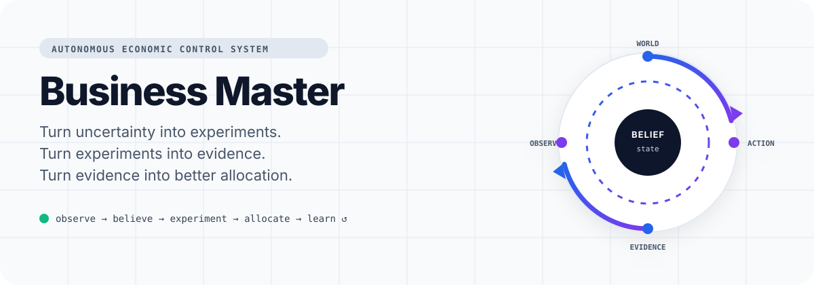
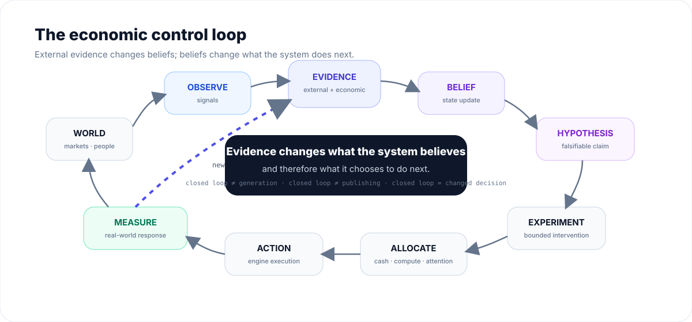

<p align="center">
  <picture>
    <source media="(prefers-color-scheme: dark)" srcset="assets/readme/hero-dark.svg">
    
  </picture>
</p>

<h1 align="center">Business Master</h1>

<p align="center">
  <strong>Autonomous Economic Control System</strong>
</p>

<p align="center">
  Turn uncertainty into experiments.<br>
  Turn experiments into evidence.<br>
  Turn evidence into better allocation.
</p>

<p align="center">
  <a href="https://github.com/AlephCasara/Business-Master/actions/workflows/test.yml"></a>
  
  
  
</p>

<p align="center">
  <a href="#the-control-loop">Control loop</a> ·
  <a href="#architecture">Architecture</a> ·
  <a href="#current-status">Status</a> ·
  <a href="#quickstart">Quickstart</a> ·
  <a href="#documentation">Documentation</a>
</p>

---

> **Business Master is not a collection of AI automations.**
>
> It is a control plane over evolving economic hypotheses.

Business Master is designed to continuously observe the world, maintain structured beliefs, design bounded experiments, allocate scarce resources, execute through reusable business engines, measure real outcomes, and update what it does next.

Its core question is:

> **What is the highest-value thing the system can learn or do next with the resources currently available?**

Human attention is one of those resources.

---

## The control loop

<p align="center">
  <picture>
    <source media="(prefers-color-scheme: dark)" srcset="assets/readme/control-loop-dark.svg">
    
  </picture>
</p>

The loop is not closed when Business Master generates something.

It is not closed when it publishes something.

It is not even closed when it measures something.

The loop closes when:

> **external evidence changes the system's beliefs and causes a different autonomous decision.**

That distinction is the center of the project.

---

## Why Business Master?

AI has made production dramatically cheaper.

Code, text, images, video, research, storefronts, prospecting, and automation are increasingly abundant. The scarce variables remain elsewhere:

| Scarce resource | Examples |
|---|---|
| **Distribution** | audience, traffic, ranking, customer access |
| **Economic knowledge** | what actually converts, retains, and scales |
| **Capital** | cash, working capital, paid experiments |
| **Platform capacity** | accounts, quotas, eligibility, reputation |
| **Compute** | CPU, GPU, VRAM, tokens, browser workers |
| **Human attention** | judgment, KYC, irreversible decisions |
| **Time** | feedback latency and opportunity windows |

Business Master therefore does not optimize for **output volume**.

It is designed to optimize for **validated learning, economic outcomes, and durable assets**.

---

## From idea to economic knowledge

A "business idea" is too coarse to be the fundamental unit of reasoning.

Business Master decomposes it into smaller falsifiable economic hypotheses.

```text
"AI ecommerce business"
          │
          ├─ demand exists
          ├─ audience responds to angle A
          ├─ creative format B captures attention
          ├─ offer C converts
          ├─ channel D acquires customers economically
          ├─ supplier E can fulfill reliably
          └─ unit economics survive scale
```

A business becomes real only when enough of those beliefs survive contact with the market.

```text
BUSINESS CANDIDATE

Demand          ● strong
Acquisition     ● strong
Offer           ● medium
Delivery        ● strong
Economics       ● strong
Repeatability   ◐ unknown
Scale           ○ unknown
```

Businesses are therefore **emergent compositions of evidence-backed beliefs**, not static workflows configured by an operator.

---

## Evidence hierarchy

Business Master distinguishes three fundamentally different evidence layers.

### Factory evidence

Did the machinery work?

```text
render succeeded
API accepted action
browser completed task
QC passed
```

### Market evidence

Did reality respond?

```text
views
retention
clicks
replies
qualified leads
checkout starts
```

### Economic evidence

Did the response create economic value?

```text
orders
settled revenue
CAC
AOV
contribution margin
LTV
repeat purchase
MRR
```

A million views are not automatically worth more than ten qualified customers.

Internal AI confidence is never market traction.

---

## Adaptive objective

The objective changes as evidence matures.

```text
DISCOVERY
    ↓
information gain
feedback speed
cheap falsification

INTENT
    ↓
clicks
replies
qualified leads

CONVERSION
    ↓
orders
CVR
AOV
revenue

ECONOMICS
    ↓
CAC
contribution margin
LTV
payback
repeatability

PORTFOLIO
    ↓
sustainable economic value
```

During cold start, a zero-revenue experiment may still be valuable if it cheaply eliminates a bad hypothesis.

As economic evidence appears, proxy metrics should progressively lose decision weight.

---

## Architecture

<p align="center">
  <picture>
    <source media="(prefers-color-scheme: dark)" srcset="assets/readme/architecture-dark.svg">
    
  </picture>
</p>

The **control plane decides what should happen**.

Execution engines provide reusable capabilities for making it happen.

### Content

```text
research → concept → creative → publish → measure → mutate
```

Content can become audience, affiliate demand, product demand, leads, or owned distribution.

### Commerce

```text
discover → validate → convert → improve fulfillment → source → scale
```

Demand should be tested before significant inventory or sourcing commitments whenever possible.

### B2B

```text
pain → prospect → offer → outreach → customer → repeated problem
```

B2B is both a cash engine and a market sensor. Repeated pain can become productized delivery or software hypotheses.

### Assets

```text
validated pattern
      ↓
software · data · brand · audience · IP · recurring revenue
```

Engines are **not separate autonomous brains**. They are execution capabilities governed by the same evidence and portfolio system.

---

## Portfolio control

Business Master can reason about different economic roles simultaneously.

| Portfolio | Purpose |
|---|---|
| **Signal** | learn cheaply and quickly |
| **Cash** | generate near-term cash flow |
| **Asset** | accumulate durable economic value |
| **Capability** | make future experiments cheaper or better |

A capability does not need to generate revenue directly. If it reduces the cost of every future validated experiment, it can still have high economic value.

---

## Resource-aware by design

The system should not pretend all resources are one interchangeable budget.

```text
cash
working capital

CPU
RAM
GPU
VRAM

LLM tokens
API quota

browser capacity
platform actions
account capacity

human minutes
```

An experiment should be able to express and eventually reserve the capacity it needs before execution.

```text
candidate action
      ↓
resource demand
      ↓
availability
      ↓
reservation
      ↓
execution
      ↓
actual usage
      ↓
release remainder
```

---

## Deterministic where possible

Business Master deliberately avoids this architecture:

```text
big LLM
   ↓
"run my businesses"
```

Different problems belong to different mechanisms.

| Mechanism | Used for |
|---|---|
| **Deterministic code** | accounting, budgets, state transitions, idempotency, quotas |
| **Statistical policy** | uncertainty, anomaly detection, allocation, saturation |
| **AI** | semantic research, hypothesis generation, creative work, perception |

AI may propose actions.

It should not get unrestricted authority over capital, accounting, or irreversible state.

---

## Autonomy proof standard

Business Master does **not** earn the word *autonomous* because it can execute several tasks without supervision.

The first constitutional proof is:

```text
Hypothesis A
     ↓
Experiment A
     ↓
real external exposure
     ↓
external measurement
     ↓
Evidence
     ↓
Belief update
     ↓
autonomous decision
     ↓
Experiment B
```

**No human prompt between A and B.**

> **Target milestone: Autonomous Closed Loop V0**

When that loop exists against a real external surface, this section should contain a recorded demonstration rather than a simulated one.

---

## Current status

> **Bootstrap / active architecture migration**

The architecture above is the project direction, not a claim that every component is already complete.

The public `main` branch contains the bootstrap autonomous-control core and its supporting RFCs, metrics, policies, persistence foundation, tests, and developer tooling.

The deeper V2 migration is being developed incrementally in [`expansion/knowledge-and-runtime`](https://github.com/AlephCasara/Business-Master/tree/expansion/knowledge-and-runtime), where structured beliefs, economic hypotheses, experiment contracts, evidence provenance, and later control layers are being introduced through bounded PRs.

The public proof standard remains unchanged: **external evidence must autonomously cause the next experiment before the system is presented as a completed autonomous business operator.**

---

## Quickstart

### NixOS

```bash
git clone https://github.com/AlephCasara/Business-Master.git
cd Business-Master

nix develop
uv pip install -e '.[dev]'

bm doctor
pytest
```

### Standard Python

Requires Python 3.13.

```bash
git clone https://github.com/AlephCasara/Business-Master.git
cd Business-Master

python3.13 -m venv .venv
source .venv/bin/activate

pip install -e '.[dev]'

bm doctor
pytest
```

`bm doctor` performs read-only capability discovery for the local runtime.

---

## Technology direction

The control-plane foundation is intentionally small.

```text
Python 3.13
Pydantic
PostgreSQL
psycopg
Typer
structlog
pytest
```

Optional infrastructure is introduced only when justified by a real execution need:

```text
durable runtime
observability
browser / desktop / mobile adapters
local or cloud inference
media generation
external platform APIs
```

Complexity must earn its place.

---

## Engineering principles

**External reality beats internal confidence.**  
AI-generated scores do not substitute for market behavior.

**Technical failure is not market rejection.**  
A broken renderer cannot falsify an economic hypothesis.

**Persist before irreversible effects.**  
Retries must not duplicate real-world actions.

**Financial arithmetic is deterministic.**  
Revenue, cost, margin, and capital accounting never depend on generated prose.

**Human attention is measured.**  
Human intervention is an explicit economic cost.

**No rewrite-driven architecture.**  
The system evolves through bounded, testable migrations.

---

## What Business Master is not

It is not:

- an AI agency template;
- a social-media bot;
- a dropshipping bot;
- a workflow library;
- an agent swarm;
- a prompt collection;
- an LLM wrapper;
- an automatic money machine.

Those may become experiment surfaces or execution adapters.

They are not the control system.

---

## Documentation

The README is the front door, not the specification.

| Document | Purpose |
|---|---|
| [`RFC-0001`](docs/RFC-0001-autonomous-control-plane.md) | autonomous control-plane architecture |
| [`METRICS_AND_OBJECTIVES`](docs/METRICS_AND_OBJECTIVES.md) | evidence and objective hierarchy |
| [`TECH_STACK`](docs/TECH_STACK.md) | implementation and adapter choices |
| [`SOURCE_LEARNINGS`](docs/SOURCE_LEARNINGS.md) | durable conclusions from research |
| [`BOOTSTRAP_24H`](docs/BOOTSTRAP_24H.md) | bootstrap execution plan |

Creator material is treated as a **source of hypotheses**, not as authoritative platform truth. Operational claims should survive independent verification before they become policy.

---

## North star

The final measure of Business Master is not:

> **How many tasks can it automate?**

It is:

> **How effectively can it convert scarce resources into validated economic knowledge, cash flow, and durable assets — while continuously improving the quality of its own decisions?**

The intended end state is a persistent economic control system that can:

```text
observe
   ↓
believe
   ↓
experiment
   ↓
measure
   ↓
learn
   ↓
allocate
   ↓
build
   ↺
```

and continue doing so when no human is there to tell it what to do next.

---

<p align="center">
  <strong>Business Master</strong><br>
  <sub>Observe reality. Allocate intelligently. Learn continuously.</sub>
</p>
